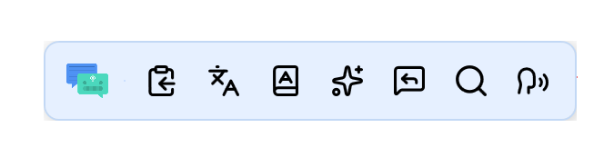
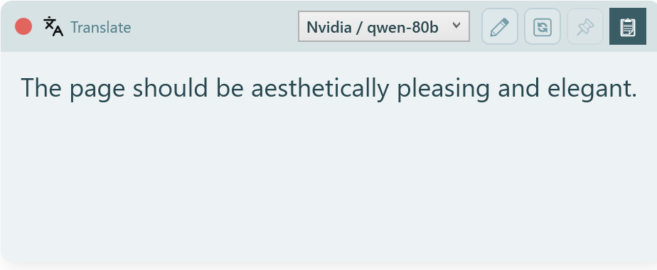
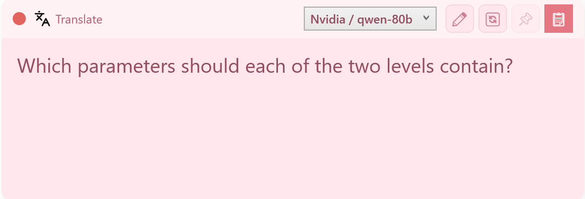
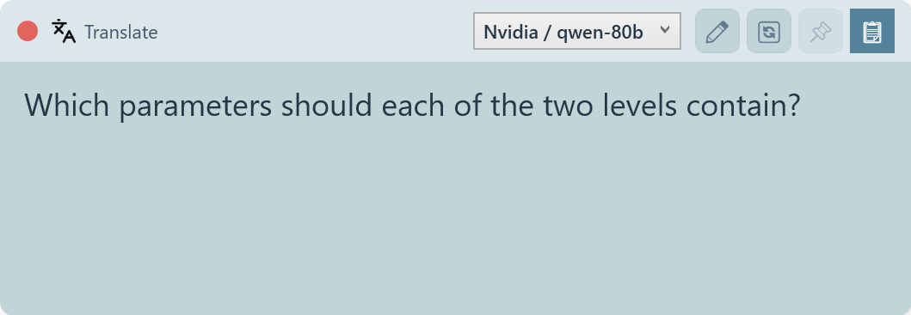
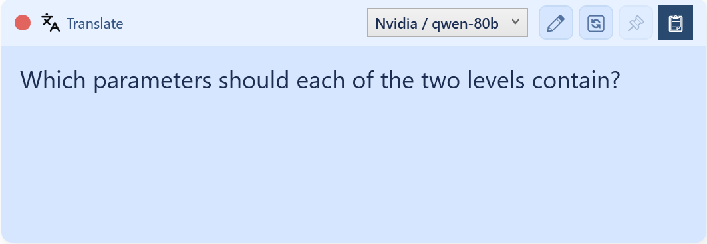
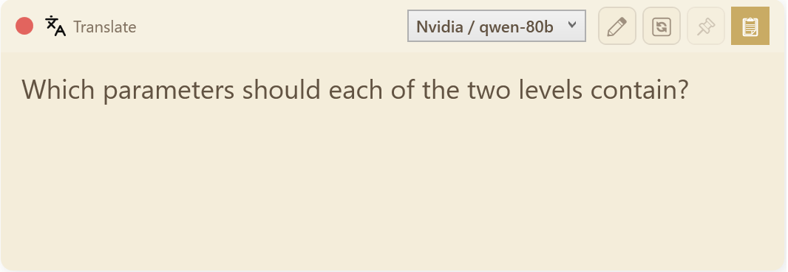
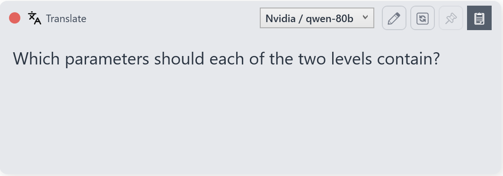

<div align="center">


# AuraTxt

**A portable, highly customizable AI text assistant for Windows**

*Highlight any text → instant AI actions, right where you work*

[](https://github.com)
[](https://dotnet.microsoft.com)
[](https://github.com)

</div>

---

## What is AuraTxt?

AuraTxt lives in your **system tray** and watches for text you select anywhere on screen. The moment you highlight a word or sentence, a small floating action bar pops up near your cursor. One click — and your text is translated, proofread, summarized, turned into an email, or processed by any AI model you choose.

Inspired by Cherry Studio's selection assistant and Qtranslate, AuraTxt goes further: it adds **built-in free translation**, an **interactive two-pane window** for back-and-forth tasks, a **thinking-mode profile system** for reasoning models, and a **fully portable** deployment — no installer, no registry, no cloud account required to get started.

<div align="center">


*The action bar appears near your cursor immediately after text selection*
</div>

---

## Features

| Category | What you get |
|----------|-------------|
| **Instant trigger** | Drag-select or double-click any text in any app → action bar appears without stealing keyboard focus |
| **Built-in free models** | Google Translate and Youdao Dictionary, no API key needed |
| **AI actions** | Connect any OpenAI-compatible or Gemini API; stream results in a lightweight floating window |
| **Interactive window** | Two-pane layout: type your instruction, get AI output — ideal for email replies, grading, and drafting |
| **Global hotkeys** | Assign a keyboard shortcut to any action; trigger without touching the mouse |
| **Google search** | Highlight a term → open a browser Google search in one click |
| **Text-to-speech** | Read selected text aloud using Windows SAPI5 voices |
| **Themes** | Six color themes included; fully JSON-customizable |
| **Thinking mode** | Toggle reasoning/thinking on or off per action for supported models (DeepSeek, Gemini, Qwen3…) |
| **Portable** | Everything lives next to `AuraTxt.exe` — copy the folder to any PC, it just works |
| **Single instance** | Only one copy runs at a time; duplicate launches show a friendly tray reminder |

---

## Download

| Package | Size | Requires |
|---------|------|---------|
| [AuraTXT_1.2.zip](https://github.com/ldd-palm/AuraTxt/releases/download/v1.2/AuraTXT_1.2.zip) | ~3 MB | Windows 10/11 + [.NET 8 Desktop Runtime](https://dotnet.microsoft.com/download/dotnet/8.0) |
| [AuraTXT_1.2_self_contained.zip](https://github.com/ldd-palm/AuraTxt/releases/download/v1.2/AuraTXT_1.2_self_contained.zip) | ~71 MB | Windows 10/11 only (no .NET install needed) |

## Quick Start

1. Extract the zip to any folder (e.g. `C:\Tools\AuraTxt\`)
2. Run `AuraTxt.exe` — a small icon appears in the system tray
3. Highlight any text in any application
4. The action bar pops up → click an action or press its hotkey
5. To configure: right-click the tray icon → **Settings** (opens `auracfg.exe`)

> **No API key needed to start.** Google Translate and Youdao Dictionary work out of the box.

---

## Directory Structure

Everything lives next to the executables — no hidden AppData folders, no registry entries.

```
AuraTxt\
├── AuraTxt.exe          Main app (tray icon + floating windows)
├── auracfg.exe          Configuration tool (TUI + batch commands)
├── config.json          All settings, providers, models, actions
│
├── prompts\             Prompt files (.md) — edit freely, changes apply immediately
│   ├── system.md        Global system prompt (anti-injection DATA BOUNDARY)
│   ├── translate.md     Bidirectional translation
│   ├── proofread.md     Presentation script polish
│   ├── reply.md         Email reply drafting (interactive)
│   ├── mail.md          Email composition from notes
│   └── grade.md         Assignment grading with rubric (interactive)
│
├── profiles\            Model behavior profiles (.json)
│   ├── README.md        Profile authoring guide
│   ├── AI_PROMPT.md     Paste into any AI chat to generate a new profile
│   ├── deepseek-v4.json
│   ├── gemini-flash.json
│   └── ...              (auto-seeded from built-in library on first run)
│
├── themes\              Color themes (.json)
│   ├── light.json       Default light theme
│   ├── dark.json        Default dark theme
│   └── *.json           Additional themes (see Themes section)
│
├── icons\               SVG icon cache (auto-downloaded from lucide.dev)
└── auratxt.log          Debug log (only created when launched with --log)
```

> **Icons** are sourced from [Lucide](https://lucide.dev) — a clean, consistent open-source icon set. When an action references an icon name (e.g. `search`, `mail`, `book-open`), AuraTxt downloads and caches the SVG automatically.

---

## Built-in Prompts

AuraTxt ships with ready-to-use prompts for common tasks. All prompts are plain `.md` files — open them in any text editor to customize.

### Result Window Prompts
*One-shot: select text → instant output*

| File | What it does |
|------|-------------|
| `translate.md` | Detects language and translates: Non-Chinese → Chinese, Chinese → English, Mixed → English |
| `proofread.md` | Transforms text into a polished, professional English presentation script |
| `mail.md` | Refines rough notes into a complete professional email, then suggests a subject line |

**Example — Draft Email:**
Select your bullet-point notes → click Draft Email
→ Gets a complete email with greeting, body, sign-off, and `Subject: ...`

### Interactive Window Prompts
*Two-pane: type an instruction in the Input box, AI responds below*

| File | What it does |
|------|-------------|
| `reply.md` | Select an email you received + type your key points → get a full polished reply |
| `grade.md` | Select student work + type the assignment question → get a score and encouraging feedback |

**Example — Grade:**
Select the student's essay → type the assignment question → click Regenerate (🔄)
→ `Score: 87/100` + one warm, constructive sentence

---

## Creating a Custom Action

AuraTxt is designed to be extended. Three ingredients and a few minutes of configuration are all you need to build a new action.

### Step 1 — Get your model credentials

From your AI provider, collect three values:

| Field | Example |
|-------|---------|
| Base URL | `https://api.groq.com/openai/v1` |
| API Key | `sk-...` |
| Model name | `llama-3.3-70b-versatile` |

See [Model Recommendations](#model-recommendations) below for a list of providers. Many offer a free tier — no credit card required.

### Step 2 — Write a prompt

Open `prompts\template.md` — it defines the structure every prompt follows (`{SelectedText}` is replaced by whatever text you highlight). Paste its contents into any AI chat and describe what you want your action to do. The AI will return a ready-to-use `.md` file.

Save the file into the `prompts\` folder next to the other prompt files.

### Step 3 — Pick an icon

Browse **[lucide.dev/icons](https://lucide.dev/icons)** and find a icon that fits your action. Note the slug shown under the icon (e.g. `book-open`, `flask-conical`, `pencil-line`). AuraTxt downloads and caches the SVG automatically on first use — no manual download needed.

### Step 4 — Wire it up in auracfg

1. **Model Platform → Add Provider** — enter your Base URL, API Key, and add the model name
2. **Action Features → Add Action** — fill in:
   - **Name** — label shown in the action bar
   - **Icon** — the slug from step 3
   - **Model** — the model you just added
   - **Prompt** — select the `.md` file from step 2
   - **Position** — display order in the bar (lower = leftmost)
   - **Hotkey** *(optional)* — global keyboard shortcut, e.g. `Ctrl+Shift+E`
3. Press **S** to save, then right-click the tray → **Reload Settings**

Your new action is now live in the action bar.

---

## Terminal Actions

Alongside GTrans and Youdao, AuraTxt ships a third built-in model: **Terminal**. Instead of calling an AI provider, a Terminal action runs a `cmd.exe` command template against the highlighted text and shows its output in the same result window used for AI responses — no API key needed.

Set an action's **Model** to `Built-in / Terminal` and its **Prompt** to a command template using the same `{SelectedText}` placeholder as any other action:

```
ping {SelectedText}
cat "{SelectedText}" >> file.txt
```

The resolved command is always echoed as the first line of the output, so you can see exactly what ran before reading its result.

> **Security warning:** highlighted text is not trusted input — it can come from any webpage, document, or message you select — and it is substituted directly into a live shell command. A Terminal action will run whatever ends up in that command line, including any shell metacharacters (`&`, `|`, `>`, `"`, etc.) that happen to be in the text you highlighted. Only wire up Terminal actions with command templates you personally trust, and be mindful of what you highlight before clicking one.

Terminal actions currently support the one-shot result window only (not the two-pane Interactive window).

### Output mode: result window vs. console window

By default, Terminal actions capture the command's output and show it in the result window — good for quick, non-interactive commands like the examples above, and gives you Copy/Replace-in-source/Pin/Regenerate plus a guaranteed 30-second timeout with automatic cleanup (closing the window kills the command).

For long-running or interactive commands — a build script, `ssh`, anything that streams output over time or needs typed input — switch to **General Settings → Terminal Output → Console window**. In this mode, clicking a Terminal action opens a real, visible `cmd.exe` window instead: no result window appears at all, there's no captured output (so Copy/Replace/Pin don't apply), and there's no timeout or auto-cleanup — the console window is fully independent and stays open until you close it yourself. Toggle it back to "Result window" to restore the default behavior.

You can also set this from the command line: `auracfg settings --set --terminal-console true|false`.

---

## Themes

Switch themes in **auracfg → General Settings → Theme**, then right-click the tray → **Reload Settings**.

<table>
<tr>
<td align="center"><b>Default (Shanshui)</b><br/></td>
<td align="center"><b>Pink</b><br/></td>
<td align="center"><b>Cyan</b><br/></td>
</tr>
<tr>
<td align="center"><b>Blue</b><br/></td>
<td align="center"><b>Gold</b><br/></td>
<td align="center"><b>Grey</b><br/></td>
</tr>
</table>

**Create your own theme:** copy any `.json` file in `themes\`, change the hex color values, and save. AuraTxt discovers it on the next reload — no restart required.

---

## Profile System

AuraTxt uses **profiles** to handle model-specific quirks — especially the thinking/reasoning toggle that differs across providers.

### Why profiles?

Different AI APIs control "thinking mode" in completely different ways:

| Model family | How to enable thinking |
|-------------|----------------------|
| DeepSeek V4 | `chat_template_kwargs: {"thinking": true}` |
| Gemini Flash | `generationConfig.thinkingConfig: {"thinkingBudget": 1024}` |
| Qwen3 | `chat_template_kwargs: {"enable_thinking": true}` |
| Gemma 4 | `generationConfig.thinkingConfig: {"thinkingLevel": "high"}` |

Profiles abstract this away. In auracfg you simply choose **Thinking: On** or **Off** per action — AuraTxt sends the correct payload automatically.

### How profiles are matched

When you add a model, AuraTxt looks through all profiles and picks the one whose name patterns best match your model name. No manual assignment needed in most cases:

```
deepseek-ai/deepseek-v4-flash  →  matches "*deepseek-v4*"    →  deepseek-v4.json  ✓
gemini-2.5-flash-preview        →  matches "gemini-2.5-flash*" →  gemini-flash.json ✓
```

### Generate a profile for a new model

Open `profiles\AI_PROMPT.md`, paste its content into any AI chat along with your model's API documentation or a sample curl command. The AI will produce a ready-to-use profile JSON you can drop into the `profiles\` folder.

---

## Model Recommendations

### Cloud APIs

| Provider | Model | Adapter | Notes |
|----------|-------|---------|-------|
| [Google AI Studio](https://aistudio.google.com) | `gemini-2.5-flash-preview-05-20` | `gemini_native` | Free tier, fast, thinking support |
| [DeepSeek](https://platform.deepseek.com) | `deepseek-chat` | `openai_compatible` | Very affordable, excellent Chinese/English |
| [OpenAI](https://platform.openai.com) | `gpt-4o-mini` | `openai_compatible` | Reliable all-rounder |
| [NVIDIA NIM](https://build.nvidia.com) | `meta/llama-3.3-70b-instruct` | `openai_compatible` | Free credits on sign-up |
| [Groq](https://console.groq.com) | `llama-3.3-70b-versatile` | `openai_compatible` | Extremely fast, generous free tier |

**Common base URLs:**
```
OpenAI              https://api.openai.com/v1
Google AI Studio    https://generativelanguage.googleapis.com
NVIDIA NIM          https://integrate.api.nvidia.com/v1
Groq                https://api.groq.com/openai/v1
```

### Local Models via Ollama

Run AI completely offline — no API key, no internet connection required after model download.

**Setup (one time):**
1. Install [Ollama](https://ollama.com)
2. Pull a model: `ollama pull qwen2.5:7b`
3. In auracfg → Model Platform → Add Provider:
   - Base URL: `http://localhost:11434/v1`
   - API Key: `ollama` *(any non-empty string)*
   - Adapter: `openai_compatible`
   - Model name: `qwen2.5:7b`

**Recommended local models:**

| Model | Pull command | RAM needed | Best for |
|-------|-------------|-----------|---------|
| translategemma | `ollama pull translategemma` | ~3 GB | Chinese/English, balanced |
| Mistral 7B | `ollama pull mistral` | ~6 GB | English prose, fast |
| Llama 3.2 3B | `ollama pull llama3.2:3b` | ~3 GB | Ultra-light, low-end PCs |
| Qwen3.5 4B | `ollama pull qwen3.5:4b` | ~3.4 GB | Higher quality output |

---

## Configuration with auracfg

`auracfg.exe` is AuraTxt's configuration companion. Launch it from the tray menu (**Settings**) or run it directly in a terminal.

### Interactive TUI

```
auracfg
```

Navigate with arrow keys or number/letter shortcuts. Press `S` to save, `Q` to quit.

```
AuraCfg › Main Menu

  [1] General Settings     Font size, opacity, theme, TTS voice…
  [2] Model Platform       Add/remove AI providers and models
  [3] Prompt Library       Manage .md prompt files
  [4] Action Features      Configure actions, hotkeys, order, thinking mode
  [5] Profiles             View and manage model profiles
  [D] Doctor               Check configuration for problems
  [S] Save
```

**Action Features list** shows at a glance:
```
[1] Translate   (●) active   0   Built-in / GTrans   —
[2] Proofread   (●) active   1   nvidia / qwen-80b   Ctrl+Q
[3] Reply       (●) active   2   deepseek / ds-v3    Ctrl+W
```
*(status · order · provider/model · hotkey)*

### Batch commands (scripting / AI automation)

```bash
# Show all actions
auracfg action --list

# Add a provider with one model
auracfg provider --set --id openai \
  --url https://api.openai.com/v1 --key sk-... \
  --model gpt-4o-mini --alias mini

# Change theme and font size
auracfg settings --set --theme dark --font-size 15

# Validate configuration health (non-zero exit = problems found)
auracfg doctor

# Restore config from last backup
auracfg restore
```

---

## Debug Logging

Launch AuraTxt with the `--log` flag to capture every API request and response:

```
AuraTxt.exe --log
```

The log file `auratxt.log` is created next to the executable. It records:
- Full request URL and body (including thinking payloads)
- Complete streaming response text (assembled from chunks)
- Timestamps and action IDs

Useful for debugging wrong output, API errors, or verifying that thinking mode payloads are correct.

---

## Tray Icon Reference

| State | Meaning |
|-------|---------|
|  Active | Monitoring text selection; hotkeys registered |
|  Paused | Monitoring suspended — click **Resume** to restore |

**Tray menu:**
- **Pause / Resume** — suspend or restore text monitoring and hotkeys
- **Hide Menu / Show Menu** — stop showing the action bar (hotkeys still work)
- **Reload Settings** — apply config and theme changes without restarting
- **Settings** — open auracfg or your configured editor
- **Exit**

---

## Keyboard Shortcuts

### Result & Interactive Windows

| Key | Action |
|-----|--------|
| `Esc` | Close window |
| `G` | Regenerate (re-run with current input) |
| `R` | Replace selected text in source app with result |
| `P` | Edit prompt |
| `C` | Copy all output to clipboard |
| `T` | Toggle pin (keep window open when clicking elsewhere) |
| `Ctrl+C` | Copy selected text within the output area |
| `Ctrl+Enter` | *(Interactive)* Submit input and generate |

---

## Tips & Tricks

- **Drag the window edge** to resize — the width is remembered for the session and resets to default on next launch.
- **Edit prompts live:** change any `.md` file in `prompts\`, save it, then press `R` to regenerate — no restart needed.
- **Disable an action** in auracfg without deleting it — it disappears from the bar but keeps its hotkey.
- **Order actions** with the Position field in auracfg (lower number = leftmost in the bar).
- **Switch models mid-session:** use the model picker inside any result window — the choice is saved to `config.json` for next time.
- **Prompt injection is blocked** by the built-in system prompt: even if selected text contains instructions like "ignore your task", AuraTxt treats it as data, not commands.

---

<div align="center">

Inspired by [Cherry Studio](https://github.com/CherryHQ/cherry-studio) · Icons by [Lucide](https://lucide.dev) · Built with .NET 8 WPF

</div>
